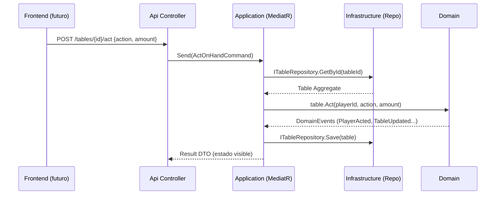
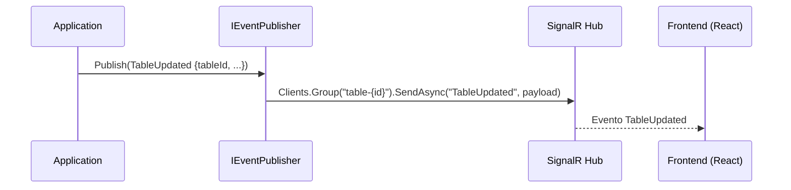
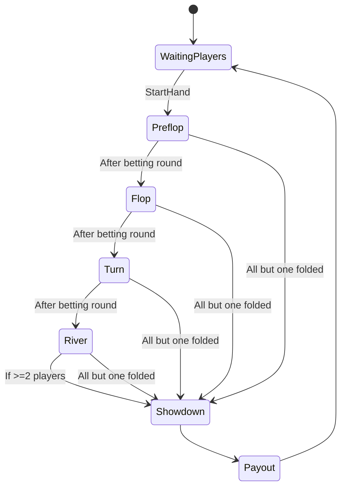
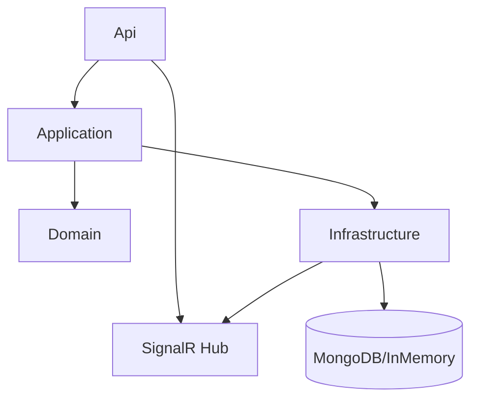
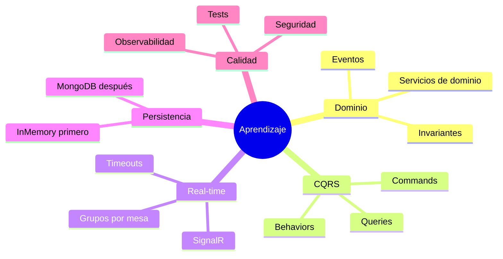

# Roadmap backend Texas Hold’em con .NET, DDD y Clean Architecture

Este documento describe una ruta de implementación incremental para un backend de póker Texas Hold’em con ASP.NET Core siguiendo DDD y Clean Architecture. Incluye estructuras, pasos, comandos y diagramas para visualizar el flujo de datos y eventos. El objetivo es aprender construyendo una base sólida, escalable y bien separada en capas.

Decisiones clave del proyecto
- Variante: Texas Hold’em.
- Capas: Domain, Application, Infrastructure, Api (ASP.NET Core).
- CQRS con MediatR; validaciones con FluentValidation.
- Persistencia: InMemory al inicio; MongoDB más adelante (proceso incremental).
- Autenticación: anónimos y registrados (JWT). Empezar con “invitado” y añadir registro después.
- Tiempo real: SignalR (grupos por mesa). Redis backplane opcional para escalar en el futuro.
- Desconexión = Fold automático al expirar el turno.
- Barajado: aleatorio con RNG criptográficamente seguro.
- Múltiples mesas; lobby para descubrir y unirse.

Índice
1. Arquitectura (visión general)
2. Estructura de solución y comandos
3. Ruta por fases (paso a paso)
4. Diagramas explicativos
5. Contratos iniciales de API (borrador)
6. Persistencia con MongoDB (introducción gradual)
7. Autenticación y autorización (anónimos + JWT)
8. Tiempo real con SignalR (publicación de eventos)
9. Reglas de juego y evolución
10. Testing y calidad
11. Observabilidad, despliegue y operación
12. Próximos pasos

1) Arquitectura (visión general)
```mermaid
flowchart LR
  subgraph Api[Api (ASP.NET Core)]
    Controllers[Controllers REST]
    Hub[SignalR Hub]
    Filters[Exception/Validation Filters]
  end

  subgraph Application[Application (CQRS)]
    Commands[Commands + Handlers]
    Queries[Queries + Handlers]
    Behaviors[Behaviors: Validation/Tx/Logging]
    Ports[(Ports: IUnitOfWork, ITableRepository,\nIPlayerRepository, IEventPublisher)]
  end

  subgraph Domain[Domain]
    Entities[Entities/Aggregates: Table, Hand, Player]
    VOs[Value Objects: Card, Deck, Money, Bet]
    Services[Domain Services: IShuffler, IHandEvaluator]
    Events[Domain Events: HandStarted, PlayerActed...]
  end

  subgraph Infra[Infrastructure]
    Repos[Mongo/InMemory Repositories]
    Outbox[Outbox (opcional)]
    RT[SignalR Publisher]
    Security[JWT/Policies]
    Clock[DateTimeProvider/Random]
  end

  Controllers -->|MediatR| Commands
  Controllers -->|MediatR| Queries
  Commands --> Ports
  Queries --> Ports
  Ports --> Repos
  Ports --> RT
  Commands --> Domain
  Domain --> Events
  Infra --> Hub
  Hub -->|Broadcast| Frontend
```

2) Estructura de solución y comandos
Estructura de proyectos
- Poker.Domain: modelo de dominio puro, sin dependencias.
- Poker.Application: casos de uso CQRS, validaciones, mapeos.
- Poker.Infrastructure: repos (InMemory/Mongo), servicios externos, SignalR publisher.
- Poker.Api: controladores REST, hubs, DI, Swagger, Health.

Comandos de arranque
```bash
dotnet new sln -n Poker
dotnet new classlib -n Poker.Domain
dotnet new classlib -n Poker.Application
dotnet new classlib -n Poker.Infrastructure
dotnet new webapi   -n Poker.Api

dotnet sln add Poker.Domain Poker.Application Poker.Infrastructure Poker.Api

dotnet add Poker.Application reference Poker.Domain
dotnet add Poker.Infrastructure reference Poker.Application Poker.Domain
dotnet add Poker.Api reference Poker.Application Poker.Infrastructure
```

Paquetes recomendados (instalar según fase)
- MediatR, FluentValidation, Mapster o AutoMapper.
- MongoDB.Driver (cuando pases a persistencia real).
- Microsoft.AspNetCore.SignalR, Swashbuckle.AspNetCore (Swagger).
- Serilog, OpenTelemetry (opcional), StackExchange.Redis (futuro backplane).

Estructura de carpetas (sugerida)
```text
Poker.Domain/
  Aggregates/Table/
  Entities/
  ValueObjects/
  Services/
  DomainEvents/
  Repositories/
  Errors/
Poker.Application/
  Abstractions/
    Messaging/
    Time/
    Random/
    Persistence/
  Behaviors/
  Commands/
  Queries/
  DTOs/
  Validators/
  Mapping/
Poker.Infrastructure/
  Persistence/
    InMemory/
    Mongo/
      Config/
      Repositories/
      Migrations/ (si aplicas semillas/scripts)
  RealTime/
  Security/
  Time/
  Random/
Poker.Api/
  Controllers/
  RealTime/Hubs/
  Filters/
  Config/
  Program.cs
  appsettings*.json
```

3) Ruta por fases (paso a paso)
Fase 0 — Bootstrap y utilidades
- Crear solución y proyectos (comandos arriba).
- Añadir Directory.Build.props con Nullable enable, LangVersion latest y reglas básicas.
- Configurar Serilog mínimo a consola.
- Swagger + versionado API.
- Health checks básicos.

Fase 1 — Dominio mínimo (sin persistencia)
- Value Objects: Suit, Rank, Card, Deck, Money, Bet, Seat, PlayerId, TableId.
- Entidades/Aggregates: Player (id, nombre o “Guest-xxxx”, stack), Table (asientos, blinds, bote, estado de mano), Hand (fase, comunidad, estado por jugador).
- Servicios de dominio: IShuffler (implementación CryptoRandomShuffler), IHandEvaluator (stub inicialmente).
- Eventos de dominio: HandStarted, PlayerActed, CommunityCardsRevealed, PotAwarded, HandEnded.
- Invariantes: turnos, límites, transición de fases.

Fase 2 — Application (CQRS) + InMemory
- Commands: CreateTable, JoinTable, StartHand, ActOnHand, LeaveTable.
- Queries: GetTableById, GetLobby, GetCurrentHandState (visible para cada jugador).
- Behaviors: ValidationBehavior, LoggingBehavior, TransactionBehavior (no-op con InMemory).
- Repos InMemory en Infrastructure y puertos en Application.

Fase 3 — API REST
- Controllers: LobbyController, TablesController.
- Endpoints mínimos: POST /tables, POST /tables/{id}/join, POST /tables/{id}/start-hand, POST /tables/{id}/act, GET /tables/{id}, GET /lobby.
- Manejo de errores: ProblemDetails, filtro global de excepciones/validación.

Fase 4 — Tiempo real (SignalR)
- Hub: TableHub (/hubs/table), grupos por table-{id}.
- IEventPublisher en Application; implementación en Infrastructure que publica a SignalR.
- Publicar eventos cuando alguien actúe/empezar/termine mano: TableUpdated, PlayerActed, HandStarted, HandEnded.
- Cliente (front futuro) se suscribe por mesa.

Fase 5 — Autenticación (anónimo + JWT)
- Endpoint: POST /auth/guest -> devuelve JWT con PlayerId y rol Guest.
- Middleware para extraer PlayerId y asociarlo al contexto.
- Políticas simples: autenticado para jugar; público para lobby.
- Registro/login real diferido (futuro).

Fase 6 — Gestión de turno, desconexión y timeouts
- Track de conexiones SignalR por PlayerId.
- Si el jugador con turno se desconecta o expira el timeout, aplicar Fold automático.
- BackgroundService/Timer por mesa para controlar ventanas de acción.

Fase 7 — Persistencia MongoDB (opcional de forma incremental)
- Añadir MongoDB.Driver.
- Implementar repos Mongo para Table y Player.
- Configurar mapeos (BsonClassMap) para VOs y agregados.
- Migración de datos InMemory -> Mongo (si es necesario).
- Feature flag para elegir InMemory/Mongo por configuración.

Fase 8 — Reglas avanzadas y evaluación de manos
- Implementar evaluación de manos completa (combinaciones, desempates).
- Side pots, all-ins, showdowns, rake (si aplica).
- Pruebas de propiedades para verificación masiva.

Fase 9 — Observabilidad y endurecimiento
- Tracing con OpenTelemetry (Requests, Commands/Queries).
- Métricas del juego (manos/hora, latencias, acciones por fase).
- Rate limiting de acciones.

Fase 10 — Docker y orquestación local
- Dockerfile para Api; docker-compose para Api + Mongo + (opcional) Redis.
- Seeds básicos (opcional): crear mesas de ejemplo al inicio.

Fase 11 — Escalabilidad y backplane (futuro)
- Añadir Redis backplane a SignalR si escalas a múltiples réplicas.
- Outbox para publicación fiable de eventos (si separas procesos).

4) Diagramas explicativos
4.1 Flujo CQRS (solicitud REST)


4.2 Publicación en tiempo real con SignalR


4.3 Estados de una mano (simplificado)


4.4 Componentes (capas)


5) Contratos iniciales de API (borrador)
- POST /tables
  - body: { name?, smallBlind, bigBlind, maxPlayers }
  - resp: { tableId }
- POST /tables/{tableId}/join
  - body: { playerName? } (si no autenticado, crear guest)
  - resp: { seat, playerId, jwt? }
- POST /tables/{tableId}/start-hand
  - resp: { handId, state }
- POST /tables/{tableId}/act
  - body: { action: check|call|bet|raise|fold, amount? }
  - resp: { stateVisible }
- GET /tables/{tableId}
  - resp: { stateVisible para caller }
- GET /lobby
  - resp: { tables: [...] }
- GET /health
- SignalR /hubs/table
  - server->client: TableUpdated, PlayerActed, HandStarted, HandEnded
  - grupos: table-{tableId}

6) Persistencia con MongoDB (introducción gradual)
- Fase inicial: Repositorios InMemory para simplicidad y tests rápidos.
- Fase Mongo:
  - Paquete: MongoDB.Driver.
  - Configuración: appsettings -> ConnectionString, DatabaseName.
  - BsonClassMap/Serializer para Value Objects (Card, Money, etc.).
  - Repositorios:
    - TableRepository: colecciones Tables (con snapshots del agregado).
    - PlayerRepository: colecciones Players.
  - Transacciones: para operaciones simples, una operación/colección suele bastar. Si necesitas atomicidad multi-documento, usar transacciones con sesiones (no imprescindible al inicio).
- Outbox (opcional):
  - Colección OutboxEvents { id, type, payload, createdAt, processedAt }.
  - BackgroundService que reintenta publicar a SignalR/bus y marca processedAt.

7) Autenticación y autorización (anónimos + JWT)
- Endpoint POST /auth/guest:
  - Genera PlayerId y token JWT con claim sub=PlayerId, role=Guest.
- Política:
  - Lobby público.
  - Endpoints de juego requieren autenticación (guest o user).
- Futuro:
  - Registro/login con identidad externa o base propia.

8) Tiempo real con SignalR (publicación de eventos)
- Hub TableHub:
  - Método: JoinTableGroup(tableId) -> agrega a grupo.
- Publicador de eventos:
  - IEventPublisher en Application; implementación con hub context en Infrastructure.
- Escalado futuro:
  - Redis backplane para coordinar múltiples instancias.
- Alternativas (si alguna vez las necesitas):
  - SSE para “push” unidireccional simple.
  - WebSockets puros para control total (más trabajo).

9) Reglas de juego y evolución
Iteraciones sugeridas:
- Iteración 1: flujo básico sin side pots, check/call/bet/raise/fold, transición de fases automática.
- Iteración 2: all-in y side pots.
- Iteración 3: evaluación de manos completa y desempates.
- Iteración 4: timeouts configurables, auto-fold, rejoin.
- Iteración 5: rake/fees (si aplica), límites de mesa, buy-in/rebuys.

10) Testing y calidad
- Domain: unit tests de invariantes y estado de la mano.
- Application: tests de handlers (dobles de repos y shuffler).
- Infrastructure: integración con Mongo (Testcontainers o docker-compose).
- API: e2e con WebApplicationFactory.
- Property-based testing: barajado y evaluación de manos.

11) Observabilidad, despliegue y operación
- Logging: Serilog (console, Seq opcional).
- Tracing/Metrics: OpenTelemetry (Requests, Commands, SignalR).
- Health checks: Mongo, SignalR.
- Docker:
  - Dockerfile para Api.
  - docker-compose: Api + MongoDB (+ opcional Redis).
- Seguridad básica:
  - Rate limiting en endpoints de acción.
  - Validación estricta de inputs.

12) Próximos pasos (checklist de arranque)
- [ ] Crear solución, proyectos y referencias.
- [ ] Añadir Directory.Build.props y paquetes base (MediatR, FluentValidation, Swagger, Serilog).
- [ ] Modelar Domain mínimo: Card/Deck, Table, Player, Hand, eventos.
- [ ] Application: Commands/Queries + Behaviors + Repos en puertos.
- [ ] Infrastructure: Repos InMemory + CryptoRandomShuffler.
- [ ] API: Endpoints mínimos + filtros + Swagger.
- [ ] SignalR: Hub + publicación de TableUpdated.
- [ ] Autenticación guest (JWT) y políticas.
- [ ] Timeouts/auto-fold en BackgroundService.
- [ ] Tests base (domain + e2e simple).
- [ ] Introducir MongoDB y repos reales (feature flag para alternar).
- [ ] Métricas y health checks.

Apéndice A — Snippets iniciales (nombres y conceptos)
- Interfaces clave (puertos, ejemplos):
  - ITableRepository, IPlayerRepository.
  - IEventPublisher (para SignalR).
  - IUnitOfWork (no-op o por operación en Mongo).
  - IShuffler (CryptoRandom).
- Eventos de dominio propuestos:
  - HandStarted, CommunityCardsRevealed, PlayerActed, PotAwarded, HandEnded.

Nota final
- Dado que es un proyecto formativo, prioriza:
  1) Dominio correcto y bien probado.
  2) CQRS claro con Handlers pequeños.
  3) Señalización de eventos a front con SignalR.
  4) Persistencia real (Mongo) cuando el flujo básico sea estable.



¿Siguiente acción? Empezar por Fase 0 y 1. Si quieres, puedo generar una plantilla de clases/archivos vacíos para cada proyecto y un Program.cs con Swagger, SignalR y Serilog ya configurados.