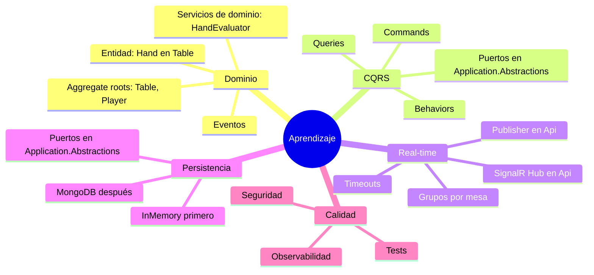

# Roadmap backend Texas Hold’em con .NET, DDD y Clean Architecture (revisado)

Este documento describe una ruta de implementación incremental para un backend de póker Texas Hold’em con ASP.NET Core siguiendo DDD y Clean Architecture. Incluye estructuras, pasos, comandos y diagramas actualizados para:

- Mantener el Hub de SignalR en Api e implementar el publisher en Api (evitando ciclos).
- Definir Table y Player como aggregate roots; Hand como entidad dentro de Table.
- Colocar los puertos de persistencia en Application.Abstractions/Persistence (y no duplicarlos en Domain).
- Ubicar IShuffler en Application.Abstractions; IHandEvaluator en Domain (determinista).

Cambios clave de este documento (respecto a la versión previa)
- SignalR:
  - Hub en Api.
  - IEventPublisher definido en Application.Abstractions/Messaging.
  - Implementación del publisher en Api utilizando IHubContext de TableHub.
  - Alternativa opcional: extraer un assembly Realtime compartido para tipos del Hub si hiciera falta, pero sin crear dependencia Api ↔ Infrastructure.
- Puertos de persistencia en Application.Abstractions/Persistence; se elimina la carpeta Repositories de Domain en la propuesta de estructura.
- Agregados: Table y Player son aggregate roots; Hand es una entidad interna del agregado Table.
- Servicios:
  - IShuffler en Application.Abstractions/Random, con implementación en Infrastructure/Random.
  - IHandEvaluator como Domain Service determinista en Domain/Services (sin dependencias externas). Si en el futuro se sustituye por una librería externa, podrá moverse a Application.Abstractions.

Decisiones clave del proyecto
- Variante: Texas Hold’em.
- Capas: Domain, Application, Infrastructure, Api (ASP.NET Core).
- CQRS con MediatR; validaciones con FluentValidation.
- Persistencia: InMemory al inicio; MongoDB más adelante (proceso incremental).
- Autenticación: anónimos y registrados (JWT). Empezar con “invitado” y añadir registro después.
- Tiempo real: SignalR (grupos por mesa). Redis backplane opcional para escalar en el futuro.
- Desconexión = Fold automático al expirar el turno.
- Barajado: aleatorio con RNG criptográficamente seguro.
- Múltiples mesas; lobby para descubrir y unirse.
- Nota anti-ciclo: La implementación de IEventPublisher vive en Api y referencia Application.Abstractions, evitando cualquier dependencia Infrastructure → Api.

Índice
1. Arquitectura (visión general)
2. Estructura de solución y comandos
3. Ruta por fases (paso a paso)
4. Diagramas explicativos
5. Contratos iniciales de API (borrador)
6. Persistencia con MongoDB (introducción gradual)
7. Autenticación y autorización (anónimos + JWT)
8. Tiempo real con SignalR (publicación de eventos)
9. Reglas de juego y evolución
10. Testing y calidad
11. Observabilidad, despliegue y operación
12. Próximos pasos
Apéndice A — Snippets iniciales (nombres y conceptos)
Nota final

1) Arquitectura (visión general)

> NOTA: Para evitar errores de Mermaid en GitHub, se han evitado paréntesis y etiquetas HTML en los labels de nodos.


2) Estructura de solución y comandos
Estructura de proyectos
- Poker.Domain: modelo de dominio puro, sin dependencias. Aggregate roots: Table, Player. Entidad: Hand dentro de Table.
- Poker.Application: casos de uso CQRS, validaciones, mapeos. Define puertos (abstracciones) en Application.Abstractions.
- Poker.Infrastructure: repositorios (InMemory/Mongo), servicios externos, implementaciones de puertos excepto IEventPublisher.
- Poker.Api: controladores REST, hubs, DI, Swagger, Health, e implementación de IEventPublisher con SignalR.

Comandos de arranque
```bash
dotnet new sln -n Poker
dotnet new classlib -n Poker.Domain
dotnet new classlib -n Poker.Application
dotnet new classlib -n Poker.Infrastructure
dotnet new webapi   -n Poker.Api

dotnet sln add Poker.Domain Poker.Application Poker.Infrastructure Poker.Api

dotnet add Poker.Application reference Poker.Domain
dotnet add Poker.Infrastructure reference Poker.Application Poker.Domain
dotnet add Poker.Api reference Poker.Application Poker.Infrastructure
```

Paquetes recomendados (instalar según fase)
- MediatR, FluentValidation, Mapster o AutoMapper.
- MongoDB.Driver (cuando pases a persistencia real).
- Microsoft.AspNetCore.SignalR en Poker.Api, Swashbuckle.AspNetCore (Swagger).
- Serilog, OpenTelemetry (opcional), StackExchange.Redis (futuro backplane).

Estructura de carpetas (sugerida)
```text
Poker.Domain/
  Aggregates/Table/
  Aggregates/Player/
  Entities/
  ValueObjects/
  Services/
  DomainEvents/
  Errors/

Poker.Application/
  Abstractions/
    Messaging/        IEventPublisher
    Time/
    Random/           IShuffler
    Persistence/      ITableRepository, IPlayerRepository, ...
  Behaviors/
  Commands/
  Queries/
  DTOs/
  Validators/
  Mapping/

Poker.Infrastructure/
  Persistence/
    InMemory/
    Mongo/
      Config/
      Repositories/
      Migrations/     si aplicas semillas o scripts
  Security/
  Time/
  Random/             CryptoRandomShuffler

Poker.Api/
  Controllers/
  RealTime/
    Hubs/             TableHub
    Publishers/       SignalREventPublisher que implementa IEventPublisher
  Filters/
  Config/
  Program.cs
  appsettings*.json
```

Nota importante sobre dependencias y evitar ciclos
- La interfaz IEventPublisher vive en Application.Abstractions y su implementación concreta en Api usando IHubContext de TableHub. De este modo:
  - Api → Application
  - Infrastructure → Application, pero nunca → Api
  - Domain no depende de nadie
- Evitar cualquier referencia de Infrastructure hacia Api.

3) Ruta por fases (paso a paso)
Fase 0 — Bootstrap y utilidades
- Crear solución y proyectos (comandos arriba).
- Añadir Directory.Build.props con Nullable enable, LangVersion latest y reglas básicas.
- Configurar Serilog mínimo a consola.
- Swagger y versionado de la API.
- Health checks básicos.

Fase 1 — Dominio mínimo sin persistencia
- Value Objects: Suit, Rank, Card, Deck, Money, Bet, Seat, PlayerId, TableId.
- Aggregate roots: Player id nombre o Guest-xxxx stack; Table asientos blinds bote estado de mano.
- Entidad dentro de Table: Hand fase comunidad estado por jugador.
- Servicios de dominio: IHandEvaluator determinista en Domain Services; IShuffler como puerto en Application.Abstractions Random.
- Eventos de dominio: HandStarted, PlayerActed, CommunityCardsRevealed, PotAwarded, HandEnded.
- Invariantes: turnos, límites, transición de fases.

Fase 2 — Application CQRS + InMemory
- Commands: CreateTable, JoinTable, StartHand, ActOnHand, LeaveTable.
- Queries: GetTableById, GetLobby, GetCurrentHandState visible para cada jugador.
- Behaviors: ValidationBehavior, LoggingBehavior, TransactionBehavior no-op con InMemory.
- Puertos en Application.Abstractions Persistence. Implementar repos InMemory en Infrastructure.

Fase 3 — API REST
- Controllers: LobbyController, TablesController.
- Endpoints mínimos: POST /tables, POST /tables/{id}/join, POST /tables/{id}/start-hand, POST /tables/{id}/act, GET /tables/{id}, GET /lobby.
- Manejo de errores: ProblemDetails, filtro global de excepciones y validación.

Fase 4 — Tiempo real SignalR
- Hub: TableHub /hubs/table, grupos por table-{id} en Poker.Api.
- IEventPublisher en Application.Abstractions; implementación en Poker.Api RealTime Publishers con IHubContext<TableHub>.
- Publicar eventos cuando alguien actúe o empiece termine mano: TableUpdated, PlayerActed, HandStarted, HandEnded.
- Cliente front futuro se suscribe por mesa.

Fase 5 — Autenticación anónimo + JWT
- Endpoint: POST /auth/guest devuelve JWT con PlayerId y rol Guest.
- Middleware para extraer PlayerId y asociarlo al contexto.
- Políticas simples: autenticado para jugar; público para lobby.
- Registro y login real diferido futuro.

Fase 6 — Gestión de turno desconexión y timeouts
- Track de conexiones SignalR por PlayerId en Api.
- Si el jugador con turno se desconecta o expira el timeout, aplicar Fold automático.
- BackgroundService o Timer por mesa para controlar ventanas de acción.

Fase 7 — Persistencia MongoDB opcional incremental
- Añadir MongoDB.Driver.
- Implementar repos Mongo para Table y Player en Infrastructure.
- Configurar mapeos BsonClassMap para Value Objects y agregados.
- Migración de datos InMemory a Mongo si es necesario.
- Feature flag para elegir InMemory o Mongo por configuración.

Fase 8 — Reglas avanzadas y evaluación de manos
- Implementar evaluación de manos completa combinaciones desempates dentro de Domain Services HandEvaluator.
- Side pots, all-ins, showdowns, rake si aplica.
- Pruebas de propiedades para verificación masiva.

Fase 9 — Observabilidad y endurecimiento
- Tracing con OpenTelemetry para Requests Commands Queries y SignalR.
- Métricas del juego manos por hora latencias acciones por fase.
- Rate limiting de acciones.

Fase 10 — Docker y orquestación local
- Dockerfile para Api; docker-compose para Api + Mongo y opcional Redis.
- Seeds básicos opcional crear mesas de ejemplo al inicio.

Fase 11 — Escalabilidad y backplane futuro
- Añadir Redis backplane a SignalR si escalas a múltiples réplicas.
- Outbox para publicación fiable de eventos si separas procesos.

4) Diagramas explicativos
4.1 Flujo CQRS solicitud REST


4.2 Publicación en tiempo real con SignalR


4.3 Estados de una mano simplificado


4.4 Componentes capas


5) Contratos iniciales de API borrador
- POST /tables
  - body: { name?, smallBlind, bigBlind, maxPlayers }
  - resp: { tableId }
- POST /tables/{tableId}/join
  - body: { playerName? } si no autenticado, crear guest
  - resp: { seat, playerId, jwt? }
- POST /tables/{tableId}/start-hand
  - resp: { handId, state }
- POST /tables/{tableId}/act
  - body: { action: check|call|bet|raise|fold, amount? }
  - resp: { stateVisible }
- GET /tables/{tableId}
  - resp: { stateVisible para caller }
- GET /lobby
  - resp: { tables: [...] }
- GET /health
- SignalR /hubs/table
  - server->client: TableUpdated, PlayerActed, HandStarted, HandEnded
  - grupos: table-{tableId}

6) Persistencia con MongoDB introducción gradual
- Fase inicial: Repositorios InMemory para simplicidad y tests rápidos.
- Fase Mongo:
  - Paquete: MongoDB.Driver.
  - Configuración: appsettings -> ConnectionString y DatabaseName.
  - BsonClassMap o Serializers para Value Objects como Card y Money.
  - Repositorios:
    - TableRepository: colección Tables snapshot del agregado.
    - PlayerRepository: colección Players.
  - Transacciones: para operaciones simples, una operación o colección suele bastar. Para atomicidad multi-documento, usar sesiones y transacciones si hiciera falta.
- Outbox opcional:
  - Colección OutboxEvents con id type payload createdAt processedAt.
  - BackgroundService que reintenta publicar a SignalR o bus y marca processedAt.

7) Autenticación y autorización anónimos + JWT
- Endpoint POST /auth/guest:
  - Genera PlayerId y token JWT con claim sub=PlayerId y role=Guest.
- Política:
  - Lobby público.
  - Endpoints de juego requieren autenticación guest o user.
- Futuro:
  - Registro y login con identidad externa o base propia.

8) Tiempo real con SignalR publicación de eventos
- Hub TableHub en Api:
  - Método: JoinTableGroup tableId agrega a grupo.
- Publisher de eventos:
  - IEventPublisher en Application.Abstractions.
  - Implementación en Api usando IHubContext<TableHub>.
- Escalado futuro:
  - Redis backplane para coordinar múltiples instancias.
- Alternativas si alguna vez las necesitas:
  - SSE para push unidireccional simple.
  - WebSockets puros para control total más trabajo.

9) Reglas de juego y evolución
Iteraciones sugeridas:
- Iteración 1: flujo básico sin side pots, check call bet raise fold, transición de fases automática.
- Iteración 2: all-in y side pots.
- Iteración 3: evaluación de manos completa y desempates.
- Iteración 4: timeouts configurables, auto-fold, rejoin.
- Iteración 5: rake fees si aplica, límites de mesa, buy-in rebuy.

10) Testing y calidad
- Domain: unit tests de invariantes y estado de la mano.
- Application: tests de handlers con dobles de repos y shuffler.
- Infrastructure: integración con Mongo Testcontainers o docker-compose.
- Api: e2e con WebApplicationFactory; pruebas del publisher de SignalR con IHubContext mockeado.
- Property-based testing: barajado y evaluación de manos.

11) Observabilidad, despliegue y operación
- Logging: Serilog console y opcional Seq.
- Tracing y métricas: OpenTelemetry Requests Commands SignalR.
- Health checks: Mongo y endpoints básicos de Api.
- Docker:
  - Dockerfile para Api.
  - docker-compose: Api + MongoDB y opcional Redis.
- Seguridad básica:
  - Rate limiting en endpoints de acción.
  - Validación estricta de inputs.

12) Próximos pasos checklist de arranque
- [ ] Crear solución, proyectos y referencias.
- [ ] Añadir Directory.Build.props y paquetes base MediatR FluentValidation Swagger Serilog.
- [ ] Modelar Domain mínimo: Card Deck, Table aggregate root, Player aggregate root, Hand entidad dentro de Table, eventos.
- [ ] Application: Commands Queries Behaviors y puertos en Abstractions Persistence Messaging Random Time.
- [ ] Infrastructure: Repos InMemory y CryptoRandomShuffler.
- [ ] Api: Endpoints mínimos filtros Swagger.
- [ ] SignalR: Hub e implementación de IEventPublisher en Api y publicación de TableUpdated.
- [ ] Autenticación guest JWT y políticas.
- [ ] Timeouts auto-fold en BackgroundService.
- [ ] Tests base domain y e2e simple.
- [ ] Introducir MongoDB y repos reales feature flag para alternar.
- [ ] Métricas y health checks.

Apéndice A — Snippets iniciales nombres y conceptos
- Interfaces clave puertos ejemplos en Application.Abstractions:
  - Persistence: ITableRepository, IPlayerRepository.
  - Messaging: IEventPublisher implementado en Api con SignalR.
  - IUnitOfWork no-op o por operación en Mongo.
  - Random: IShuffler implementación CryptoRandom en Infrastructure.
- Servicios de dominio en Domain:
  - HandEvaluator determinista sin dependencias externas.
- Eventos de dominio propuestos:
  - HandStarted, CommunityCardsRevealed, PlayerActed, PotAwarded, HandEnded.

Nota final
- Dado que es un proyecto formativo, prioriza:
  1) Dominio correcto y bien probado Table y Player como aggregate roots; Hand como entidad en Table.
  2) CQRS claro con Handlers pequeños.
  3) Señalización de eventos a front con SignalR con publisher implementado en Api para evitar ciclos.
  4) Persistencia real Mongo cuando el flujo básico sea estable.


